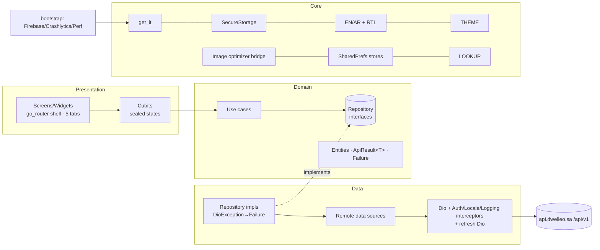
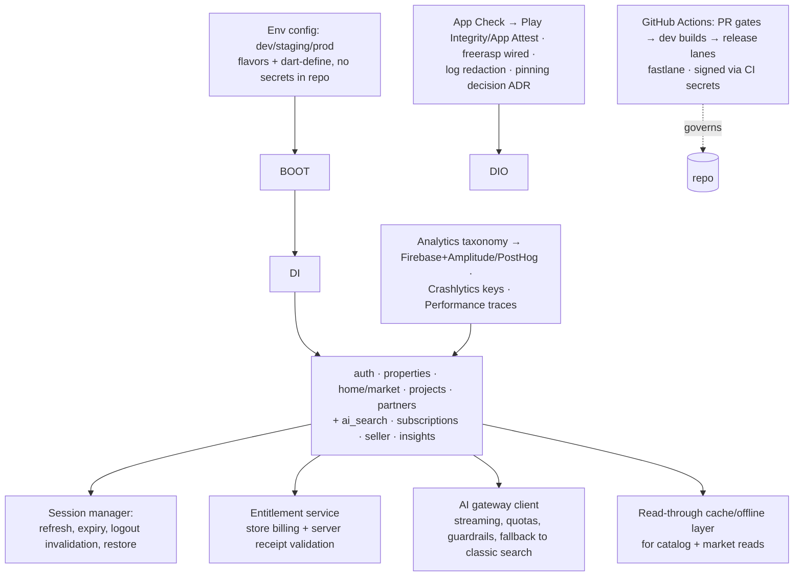

# Architecture — Current & Target

## Current (verified)

Rules enforced today: presentation→domain→data only; domain has zero Flutter
imports; cubits depend on use cases only; shared code in `core/`; no codegen/Freezed.

## Target production architecture (additive — no rewrite)

Decisions requiring ADRs before build: offline/cache store choice; billing
approach (store vs backend-managed for KSA); pinning strategy; AI streaming
transport; entitlement sync model. ADR template: handoff `architecture/adr/0001`.
